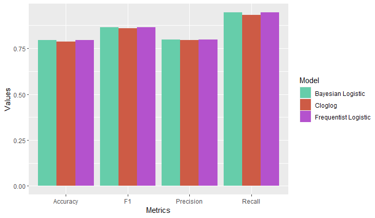

# Loan Eligibility Bayesian Prediction
This Repository refers to the final project of the course Statistical Methods in Data Science and Laboratory II (SDS2) at University Sapienza of Rome 2021/2022.

# Abstract
Today there are many people and businesses that apply for bank loans. The main activity of
every bank is the distribution of loans, so its goal must be to give money to people who will pay it
back. But for the verification process they take a long time. To predict if a client may be eligible
for a loan I applied three models 1) Bayesian Logistic Regression, 2) Bayesian Cloglog and 3)
Frequentist Logistic Regression. In this way, using certain characteristics of loan applicants, the
models were able to predict an applicant’s eligibility quite well, as affirmed by the high values of
the calculated metrics.

